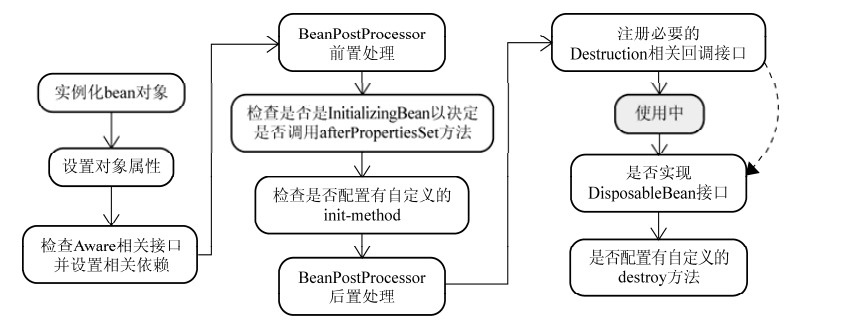

#目录
* [spring 核心](#spring 核心)
* [入门实例](#入门实例)
* [Bean](#Bean)
* [依赖注入](#依赖注入)
* [注解配置](#注解配置)
* [java配置](#java配置)
* [Spring事件](#Spring事件)
#### spring 核心
spring 框架提供了20多个模块，spring的架构图如下：

* 核心容器
&emsp;&emsp;核心容器由核心（core），Bean，上下文和表达式语言模块组成。`核心`模块提供了框架的基本组成部分，包括依赖注入。`Bean`模块提供BeanFactory，他是一个功能的复杂实现。`上下文模块`在由核心和Bean的基础上，访问定义和配置的任何对象的媒介，其中ApplicationContext是重点。`表达式语言`提供了查询和操作一个对象的强大的表达式语言。
* 数据访问/集成
&emsp;&emsp;数据访问/集成层包括 JDBC，ORM，OXM，JMS 和事务处理模块，它们的细节如下：
&emsp;&emsp;JDBC 模块提供了删除冗余的 JDBC 相关编码的 JDBC 抽象层。
&emsp;&emsp;ORM 模块为流行的对象关系映射 API，包括 JPA，JDO，Hibernate 和 iBatis，提供了集成层。
&emsp;&emsp;OXM 模块提供了抽象层，它支持对 JAXB，Castor，XMLBeans，JiBX 和 XStream 的对象/XML 映射实现。
&emsp;&emsp;Java 消息服务 JMS 模块包含生产和消费的信息的功能。
&emsp;&emsp;事务模块为实现特殊接口的类及所有的 POJO 支持编程式和声明式事务管理。
* Web
&emsp;&emsp;Web 层由 Web，Web-MVC，Web-Socket 和 Web-Portlet 组成，它们的细节如下：
&emsp;&emsp;Web 模块提供了基本的面向 web 的集成功能，例如多个文件上传的功能和使用 servlet 监听器和面向 web 应用程序的上下文来初始化 IoC 容器。
&emsp;&emsp;Web-MVC 模块包含 Spring 的模型-视图-控制器（MVC），实现了 web 应用程序。
&emsp;&emsp;Web-Socket 模块为 WebSocket-based 提供了支持，而且在 web 应用程序中提供了客户端和服务器端之间通信的两种方式。
&emsp;&emsp;Web-Portlet 模块提供了在 portlet 环境中实现 MVC，并且反映了 Web-Servlet 模块的功能。
* 其他还有其他一些重要的模块，像 AOP，Aspects，Instrumentation，Web 和测试模块，它们的细节如下：
&emsp;&emsp;AOP 模块提供了面向方面的编程实现，允许你定义方法拦截器和切入点对代码进行干净地解耦，它实现了应该分离的功能。
&emsp;&emsp;Aspects 模块提供了与 AspectJ 的集成，这是一个功能强大且成熟的面向切面编程（AOP）框架。
&emsp;&emsp;Instrumentation 模块在一定的应用服务器中提供了类 instrumentation 的支持和类加载器的实现。
&emsp;&emsp;Messaging 模块为 STOMP 提供了支持作为在应用程序中 WebSocket 子协议的使用。它也支持一个注解编程模型，它是为了选路和处理来自 WebSocket 客户端的 STOMP 信息。
&emsp;&emsp;测试模块支持对具有 JUnit 或 TestNG 框架的 Spring 组件的测试。

#### 入门实例
需要的核心jar包为：
* commons-logging-1.1.1

* spring-aop-4.1.6.RELEASE

* spring-aspects-4.1.6.RELEASE

* spring-beans-4.1.6.RELEASE

* spring-context-4.1.6.RELEASE

* spring-context-support-4.1.6.RELEASE

* spring-core-4.1.6.RELEASE

* spring-expression-4.1.6.RELEASE

* spring-instrument-4.1.6.RELEASE

* spring-instrument-tomcat-4.1.6.RELEASE

* spring-jdbc-4.1.6.RELEASE

* spring-jms-4.1.6.RELEASE

* spring-messaging-4.1.6.RELEASE

* spring-orm-4.1.6.RELEASE

* spring-oxm-4.1.6.RELEASE

* spring-test-4.1.6.RELEASE

* spring-tx-4.1.6.RELEASE

* spring-web-4.1.6.RELEASE

* spring-webmvc-4.1.6.RELEASE

* spring-webmvc-portlet-4.1.6.RELEASE

* spring-websocket-4.1.6.RELEASE

创建实例bean
```java
public class HelloWorld {
   private String message;
   public void setMessage(String message){
      this.message  = message;
   }
   public void getMessage(){
      System.out.println("Your Message : " + message);
   }
}
```
配置bean的xml文件
```xml
<?xml version="1.0" encoding="UTF-8"?>

<beans xmlns="http://www.springframework.org/schema/beans"
    xmlns:xsi="http://www.w3.org/2001/XMLSchema-instance"
    xsi:schemaLocation="http://www.springframework.org/schema/beans
    http://www.springframework.org/schema/beans/spring-beans-3.0.xsd">

   <bean id="helloWorld" class="com.tutorialspoint.HelloWorld">
       <property name="message" value="Hello World!"/>
   </bean>

</beans>
```

然后在Main函数中得到bean
```java
import org.springframework.context.ApplicationContext;
import org.springframework.context.support.ClassPathXmlApplicationContext;
public class MainApp {
   public static void main(String[] args) {
      ApplicationContext context = 
             new ClassPathXmlApplicationContext("Beans.xml");
      HelloWorld obj = (HelloWorld) context.getBean("helloWorld");
      obj.getMessage();
   }
}
```

#### Bean
* bean的定义称为`配置元数据`

| 属性  | 描述 |
| :----------: | :-----------:|
|class|	这个属性是强制性的，并且指定用来创建 bean 的 bean 类。|
|name |	这个属性指定唯一的 bean 标识符。在基于 XML 的配置元数据中，你可以使用 ID 和/或 name 属性来指定 bean 标识符。|
|scope|	这个属性指定由特定的 bean 定义创建的对象的作用域，它将会在 bean 作用域的章节中进行讨论。|
|constructor-arg|	它是用来注入依赖关系的，并会在接下来的章节中进行讨论。|
|properties	|它是用来注入依赖关系的，并会在接下来的章节中进行讨论。|
|autowire|	它是用来注入依赖关系的，并会在接下来的章节中进行讨论。|
|lazy-init|	延迟初始化的 bean 告诉 IoC 容器在它第一次被请求时，而不是在启动时去创建一个 bean 实例。|
|init-method|	在 bean 的所有必需的属性被容器设置之后，调用回调方法。它将会在 bean 的生命周期章节中进行讨论。|
|destroy-method|	当包含该 bean 的容器被销毁时，使用回调方法。它将会在 bean 的生命周期章节中进行讨论。|

配置元数据可以由xml文件定义，可以用注解进行定义同时还可以用java配置。

* Bean scope
如果想是单例的话就用singleton，多例用prototype。

| 作用域 | 描述 |
|--------|--------|
|    singleton    | 该作用域将 bean 的定义的限制在每一个 Spring IoC 容器中的一个单一实例(默认)。|
| prototype| 	该作用域将单一 bean 的定义限制在任意数量的对象实例。| 
| request	| 该作用域将 bean 的定义限制为 HTTP 请求。只在 web-aware Spring  ApplicationContext 的上下文中有效。| 
| session| 	该作用域将 bean 的定义限制为 HTTP 会话。 只在web-aware Spring ApplicationContext的上下文中有效。| 
| global-session| 	该作用域将 bean 的定义限制为全局 HTTP 会话。只在 web-aware Spring ApplicationContext 的上下文中有效。       |

* Bean 生命周期
 主要是init-method 和 destory-method 

使用init-method的方法
```xml
<bean id="exampleBean"  class="examples.ExampleBean" init-method="init"/>
<!-- init方法在ExampleBean中定义 -->
```
```java
public class ExampleBean {
   public void init() {
      // do some initialization work
   }
}
```
同样的道理，如果要用destory-method，那么：
```xml
<bean id="exampleBean"  class="examples.ExampleBean" destory-method="destory"/>
<!-- init方法在ExampleBean中定义 -->
```
```java
public class ExampleBean {
####    public void destory() {
      // do some initialization work
   }
}
```

* Bean的后置处理

`BeanPostProcessor`接口作用是：**如果我们需要在Spring容器完成Bean的实例化、配置和其他的初始化前后添加一些自己的逻辑处理，我们就可以定义一个或者多个BeanPostProcessor接口的实现，然后注册到容器中。**
spring中bean的实例化过程如图：


这个接口有两个需要实现的方法。postProcessBeforeInitialization和postProcessAfterInitialization

* Bean定义继承

在xml中，使用parent属性，例如
```xml
   <bean id="helloIndia" class="com.tutorialspoint.HelloIndia" parent="helloWorld">
      <property name="message1" value="Hello India!"/>
      <property name="message3" value="Namaste India!"/>
   </bean>
```
还可以在xml中定义模板
```xml
   <bean id="templateBean" abstract="true" >
   	<property name="name" value="zhongguo"></property>
   </bean>
   <bean id="helloJS" class="com.xixi.bean.HelloJS" parent="templateBean"/>
```
但是模板bean中的所有属性，继承的bean必须全部要有，否则报错。

#### 依赖注入
依赖注入有两种方式，`构造函数注入`和`set方法注入`

* 构造函数注入

可以使用如下三种方式：
```xml
 <!-- 构造函数注入 -->
  <bean id="car" class="com.xixi.bean.Car">
   		<constructor-arg ref="door"/>
   		<constructor-arg ref="wheel"/>
   </bean>
   <bean id="car" class="com.xixi.bean.Car">
   		<constructor-arg type="java.lang.String" value="bmw"/>
   		<constructor-arg type="java.lang.String" value="007"></constructor-arg>
   </bean>
   <bean id="car" class="com.xixi.bean.Car">
   		<constructor-arg index="0" value="bmw"/>
   		<constructor-arg index="1" value="007"/>
   </bean>
   <bean id="door" class="com.xixi.bean.Door"/>
   <bean id="wheel" class="com.xixi.bean.Wheel"/>
```

* set方法注入
 在xml中使用的是property元素或者使用p-namespace 

```xml
    <!-- set方法注入 -->
    <bean id="car" class="com.xixi.bean.Car">
    	<property name="carName" value="bmw"></property>
    </bean>
    <bean id="car" class="com.xixi.bean.Car" p:carName="bmw"/>
    <!-- 使用p的时候要在开头加上校验
      xmlns:p="http://www.springframework.org/schema/p"
      -->
```

* 在bean中注入集合

```xml
   <bean id="collectionMapBean" class="com.xixi.bean.CollectionMapBean">
		<property name="addressList">
			<list>
				<value>china</value>
				<value>uk</value>
			</list>
		</property>
		<property name="addressSet">
			<set>
				<value>india</value>
				<value>budan</value>
			</set>
		</property>
		<property name="addressMap">
			<map>
				<entry key="1" value="INDIA" />
				<entry key="2" value="Pakistan" />
				<entry key="3" value="USA" />
				<entry key="4" value="USA" />
			</map>
		</property>
		<property name="addressProperties">
			<props>
				<prop key="one">INDIA</prop>
				<prop key="two">Pakistan</prop>
				<prop key="three">USA</prop>
				<prop key="four">USA</prop>
			</props>
		</property>
	</bean>
```

* 自动注入Bean

前面讲的都是手动注入Bean，Spring还可以通过以下几种方式自动注入Bean。第一种方式是byName，第二种byType，第三种constructor，第四种autodetect（先尝试constructor，再用byType）
 * byName
```xml
<!-- 自动注入door和wheel -->
	<bean id="car" class="com.xixi.bean.Car" autowire="byName"/>
	<bean id="door" class="com.xixi.bean.Door" />
	<bean id="wheel" class="com.xixi.bean.Wheel"/>
```
 * byType
同理是一样的，只不过是找相同的类去注入。
 *  byConstructor
同理按照构造器自动注入。

```xml
   <bean id="textEditor" class="com.tutorialspoint.TextEditor" 
      autowire="constructor">
      <constructor-arg value="Generic Text Editor"/>
   </bean>

```

####注解配置
 启用注解配置的话需要在xml中添加
```xml
 <context:annotation-config/>
 <!--
    需要增加校验
	http://www.springframework.org/schema/context
    http://www.springframework.org/schema/context/spring-context-4.3.xsd
    -->
```
注意：使用注解的方式并不能完全脱离xml文件。只能减少xml的配置项。
声明Bean的注解有`@Component`,`@Service`,`@Repository`,`@Controller`。
注入Bean的注解有`@AuAutowired`,`@Inject`,`@Resource`。

声明Bean的组件必须在xml文件中加入下面这句话让spring自动寻找这些bean：
```xml
<context:component-scan base-package="com.xixi.bean"/>
```
声明Bean的注解后面可以加上scope
```java
@Component
@Scope("singleton")
public class Car {
}
```

Autowired注入bean可以写在类成员，构造函数，set方法上

####java配置

和xml配置bean功能相同，表现形式不同而已。用java配置的bean的方法如下：
```java
@Configuration //声明是个java配置bean 也可以引入另一个Config ，@Import(Config2.class)
public class MyConfig{
	@Bean //声明一个bean  @Bean(initMethod="方法名",destoryMethod="") @Scope("");
    public Car  car(){
    	return new Car();
    }
}
```
然后可以利用AnnotationConfigApplicationContext得到Bean

```java
public static void main(String[] args) {
   ApplicationContext ctx = 
   new AnnotationConfigApplicationContext(MyConfig.class);
   Car car=ctx.getBean(Car.class);
}
```

####Spring事件
spring中有四种事件，分别是`ContextRefreshedEvent`，`ContextStartedEvent`，`ContextStoppedEvent`，`RequestHandledEvent`
如何监听这些事件？实现ApplicationListener<ContextStartedEvent>接口
```java

import org.springframework.context.ApplicationListener;
import org.springframework.context.event.ContextStartedEvent;
import org.springframework.stereotype.Component;

@Component
public class MyStartEventListener implements ApplicationListener<ContextStartedEvent> {

	public void onApplicationEvent(ContextStartedEvent arg0) {
		System.out.println("start context!!"+arg0.getTimestamp());
	}

}
```

####springAOP


