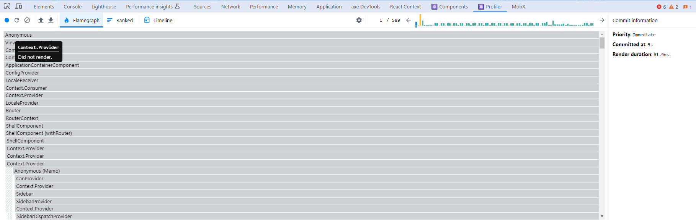
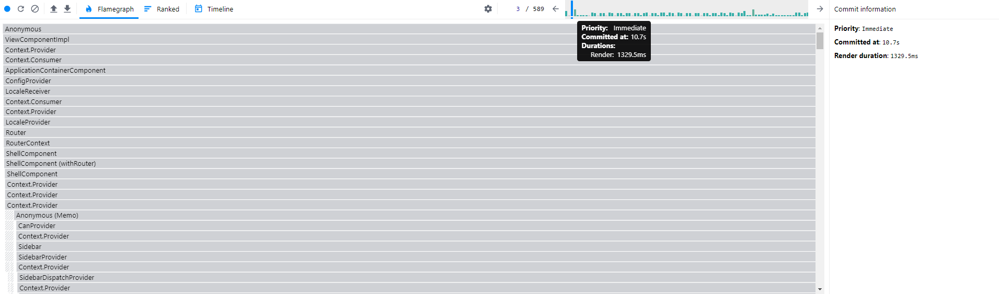
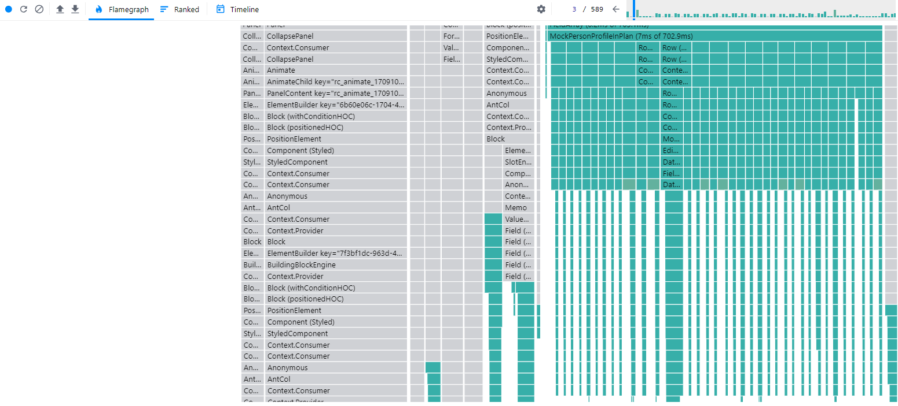
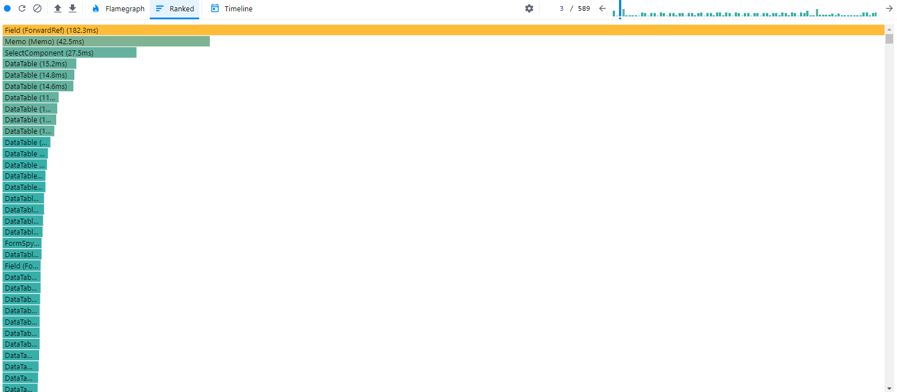

### React 性能优化

在项目中我们遇到React项目的性能问题，表现为切换tab卡，输入框输入（瓶颈）特别卡。这里我们简单记录一下分析以及解决过程。

### Profiler整体介绍

我们利用Profiler 来分析输入时哪些组件被render，以及哪些组件render的时间过长。首先我们先点击蓝色按钮start profile。然后我们在输入框输入数字。最后我们点击红色按钮结束profile。

我们这里有一个简单的示例 如下图。



我们从上往下介绍一下这个界面，最上方一行分别是

* 蓝色按钮 start profile/stop
* 刷新按钮 刷新
* 删除按钮 移除当前的profile
* 向上箭头 load 保存过的profile
* 向下箭头 保存当前的profile
* Flamegraph 火焰图，看当前整体react tree的render情况
* Ranked 按render时间排序的Component图
* Timeline （React 16版本暂时没有该功能）
* 设置按钮 设置一些监控的参数，比如Component render的时候在页面highlight
* 柱状图区域 显示了render多少次，每次render消耗了多少时间

我们重点关注时间消耗较高的render（比如说途中柱状图区域中黄色的那个柱），点击黄色的柱状（如下图），可以看到render 时长1300多毫秒



此时看Flamegraph图，可以看到灰色是没有render的部分，绿色的是重新render的部分。这里有一张大量render的图如下：



同时我们也可以查看Ranked图，看什么组件消耗时间过长。这里我们也有一张图如下。




### 分析问题

接下来分析输入卡的问题，接下来我们分析这个case，首先我们可以看到图三很多datatable被重新render，这些和输入框没有任何关系。所以我们重点是优化这些datatable。在优化之前，我们可以查看一下这些component为什么会被重新render。


先来简单介绍一下React component怎么会重新render，主要以下几个原因：

1. parent component render 
2. props 改变 
3. 引用的context改变
4. hook 改变。

而我们从图上看是props改变导致我们这个component重新render。


### 解决问题

对于不需要重新render的组件，我们可以尝试使用React.memo, 对于一些函数要用useCallback, useMemo 来控制render

这里简单给出一些代码

首先是React.memo

```typescript
const MockPersonProfileInPlan: FC<MockPersonProfileInPlanProps> = React.memo(
    ({fields, createNewEntity, onMockPersonProfileChange}: MockPersonProfileInPlanProps) => {
        return (
            <div className={mockPersonProfileClassName}>
                details are omitted
            </div>
        )
    },
    (prev, next) => {
        const prevPlans = prev?.fields?.value ?? []
        const nextPlans = next?.fields?.value ?? []

        if (prevPlans?.length !== nextPlans?.length) {
            return false
        } else {
            for (let i = 0; i < prevPlans?.length; i++) {
                const prevPlan = prevPlans?.[i]
                const nextPlan = nextPlans?.[i]
                const rateDetails = prevPlan?.coverageDefs?.map(oneCov => oneCov?.rateDetail)
                const nextRateDetails = nextPlan?.coverageDefs?.map(oneCov => oneCov?.rateDetail)
                const isEqualRateDetails = isEqual(rateDetails, nextRateDetails)

                if (!isEqualRateDetails) {
                    return false
                }
            }
            return true
        }
    }
)
```

其次是useMemo,这里避免每次创建新的{evaluate} 对象

```typescript
export const useKrakenEvaluationContext: () => KrakenEvaluationContextReturnValue = () => {
    const {rulesEvaluationProps} = useContext(KrakenEvaluationContext)
    const krakenEngine = FormKraken.useKraken(rulesEvaluationProps.krakenService)

    const evaluateFunction = useMemo(() => {
        return {
            evaluate: (options?: any) => {
                //details are omitted
                return noop(options)
            }
        }
    }, [rulesEvaluationProps])
    return evaluateFunction
}
```