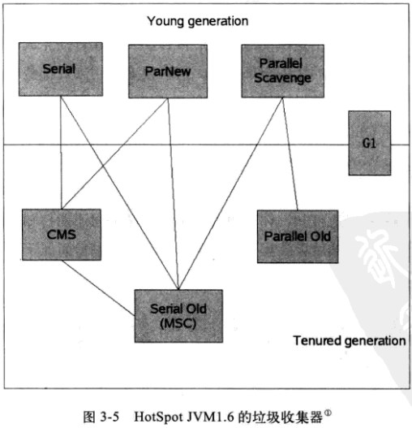

##目录
* [java内存区域分布](#内存分布)
* [垃圾收集器与内存分配策略](#垃圾收集器与内存分配策略)
####内存分布
一共分为五个部分。`程序计数器`,`虚拟机栈`,`本地方法栈`,`方法区`,`堆` 。
* #####程序计数器
   &emsp;&emsp;程序计数器是一块较小的内存空间，他可以看作当前线程所执行的字节码的行号指示器。在多线程中，每个线程都有一个独立的程序计数器，各个线程之间互不影响。所以程序计数器这块内存是**私有**的。
* #####虚拟机栈
  &emsp;&emsp;虚拟机栈也是**私有**的，虚拟机栈描述的是java方法执行的内存模型，每个方法在执行时会创建一个栈帧(Stack Frame)，栈帧中存储局部变量表，操作数栈，动态链接，方法出口等信息。每个方法从调用到执行完成的过程就对应着一个栈帧在虚拟机栈中入栈到出栈的过程。
  &emsp;&emsp;常常会有人把java内存分为堆内存和栈内存，这里的栈指的就是虚拟机栈中的局部变量表部分。
  &emsp;&emsp;局部变量表存放各个基本数据类型、对象引用和returnAddress类型，局部变量表的内存空间在编译时完成分配。
  &emsp;&emsp;可能的异常类型：如果线程请求的栈深度大于虚拟机允许的深度，抛出StackOverflowError异常，如果虚拟机可以动态扩展，如果扩展无法申请到足够内存，抛出OutOfMemoryError异常。
* #####本地方法栈
  &emsp;&emsp;和虚拟机栈类似，只不过虚拟机栈执行的是java方法，而本地方法栈执行的是native方法。
* #####Java堆
  &emsp;&emsp;java堆是**共享**的内存。这个内存区域唯一的目的就是存放对象实例，几乎所有的对象实例和数组都在堆上分配。
  &emsp;&emsp;java堆是垃圾收集的主要区域，在之后会详细介绍。
  &emsp;&emsp;java堆可以是固定的，也可以是扩展的（通过-Xmx和-Xms控制），如果堆中没有内存完成分配并且无法扩展，将抛出OutOfMemoryError异常。
* #####方法区
  &emsp;&emsp;方法区和java堆一样，是各个线程共享的内存区域。用来存储虚拟机加载的类信息，常量，静态变量，即时编译器编译后的代码等数据。
   &emsp;&emsp;会抛出OutOfMemoryError异常。
   &emsp;&emsp;方法区中还有一个部分叫做运行时常量池，用于存放编译期生成的各种字面量和符号引用，这部分内容将在类加载后进入方法区的运行时常量池中存放。(**jdk1.7之后常量池被移出方法区**)

- - -

####垃圾收集器与内存分配策略
 ##### 1.对象是否死亡
  &emsp;&emsp;判断对象是否死亡有两种，第一种`引用记数法`，第二种`可达性分析方法`。
  1.1 引用记数法
   &emsp;&emsp;这种方法给对象添加一个引用计数器，每当有一个地方引用它时，计数器的值加1，当减少一个引用时，计数器减1，当计数器为0时就是不能再被使用。
   &emsp;&emsp;这种方法实现简单，效率高，但是却不是java虚拟机里面采用的，原因在于他很难解决对象之间的**循环引用**的问题
   举例如下：
   ```java
   public class ReferenceCountingGC{
        public Object instance=null;
        //private static final int _1MB=1024*1024;
        public static void testGC(){
        	ReferenceCountingGC objA=new ReferenceCountingGC();
            ReferenceCountingGC objB=new ReferenceCountingGC();
            objA.instance=objB;
            objB.instance=objA;
            
            objA=null;
            objB=null;
            //假设这里出现gc
            System.gc();
        }
   
   }
   ```
&emsp;&emsp;从结果来看，GC日志中的确回收了这两个对象。
1.2可达性分析算法
 &emsp;&emsp;这个算法的基本思路就是通过一系列的被称为`GC Roots`的对象作为起始点，从这些节点往下搜索，当一个对象到GC Roots没有任何引用链（也就是不可达），这证明这个对象是不可用的。
 &emsp;&emsp;在java语言中，可作为GC Roots的对象包括下面几种
 -  虚拟机栈（栈帧中的本地变量表）中引用的对象
 -  方法区中静态属性引用的对象
 -  方法区中常量引用的对象
 -  本地方法栈中JNI引用的对象
 
##### 2.引用的定义
&emsp;&emsp;引用分为`强引用`，`软引用`，`弱引用`，`虚引用` 四种。
- 强引用就是程序中普遍存在的，就是之间关联的引用，垃圾收集器不会回收这些引用对象。
- 软引用用来描述一些还有用但是并非必需的对象。在系统将要发生内存溢出之前，才会将这些对象列进回收范围之内进行第二次回收，如果这次回收还没有足够的内存，才会抛出内存溢出异常。
- 弱引用也是用来描述非必需对象的，但是它的强度比软引用还要弱，被弱引用关联的对象只能生存到下一次垃圾回收发生之前。当垃圾收集器工作时，这些被弱引用关联的对象都会被回收掉。
- 虚引用也称幽灵引用，它是最弱的一种引用，为一个对象设置虚引用关联的唯一目的就是能在这个对象被收集器回收时收到一个系统通知。

##### 3.方法区的回收
&emsp;&emsp;很多人认为方法区（或者Hotspot虚拟机中的永久代）没有垃圾收集，但是是有的。永久代的垃圾收集主要有两部分，`废弃常量`和`无用的类`。
&emsp;&emsp;判断一个常量是否是废弃常量比较简单，而要判断一个类是否无用的类的条件就苛刻很多。需要满足以下三个条件。
- 该类的所有实例都已经被回收，也就是堆中不存在任何该类的任何实例。
- 加载该类的ClassLoader已经被回收
- 该类对应的java.lang.Class对象没有在任何对方被引用，无法在任何地方通过反射访问该类的方法。
&emsp;&emsp;HotSpot虚拟机中提供-Xnoclassgc参数进行控制，还可以使用-verbose:class以及-XX:+TraceClassLoading中查看。

##### 4.垃圾回收算法
- 4.1 标记清除法
&emsp;&emsp;算法分为标记和清除两个阶段，首先标记需要回收的对象，在标记完统一回收，它是最基本的收集算法。他有两个不足之处，第一是效率问题，标记和清除两个过程效率都不高；第二是空间问题，标记之后会产生大量的不连续的内存碎片，碎片太多可能会导致需要分配打对象时，无法找到足够的连续的内存而不得不重新垃圾回收。
- 4.2 复制算法
&emsp;&emsp;复制算法将内存分为大小相等的两块，每次只使用其中的一块。当这一块内存用完了，将存活的对象复制到另一块，然后把这一块的内存清理掉。
&emsp;&emsp;现阶段商业虚拟机都是采用这种收集算法来回收**新生代**。首先新生代的对象98%都是朝生夕死的，所以并不需要1:1划分内存空间，而是将内存分为一块较大的eden空间和两块较小的Survivor空间。每次都使用Eden和一块Survivor空间。当进行垃圾回收时，将Eden和用过的Survivor空间复制到另一块Survivor空间上，最后清理掉Eden和刚才使用过的Survivor空间HotSpot虚拟机中默认Eden和Survivor的大小比例为8:1，也就是每次新生代可用的内存空间为90%（80%+10%）。
- 4.3 标记-整理算法
&emsp;&emsp;在老年代中，有人提出一种标记-整理算法。标记过程和“标记-清除”算法一样，但后续步骤不是直接清理，而是将所有存活的对象都向一端移动，然后清理掉没用的内存。
- 4.4 分代收集算法
&emsp;&emsp;根据对象存活周期，在新生代选用复制算法，在老年代总选用标记整理或者标记清除算法。

##### 5.HotSpot中的对象存活和垃圾收集算法实现
- 对象存活的算法
 &emsp;&emsp;前面说到可达性分析从GC Roots开始找引用链，可作为GC Roots的节点为全局性的引用（例如常量或静态属性）与执行上下文（栈帧中的本地变量表）中，如果逐个检查这些引用，将耗费大量时间。
 &emsp;&emsp;另外，可达性分析中，还必须停顿所有java执行线程（sun称为为stop the world）。
 &emsp;&emsp;当系统停顿下来时，并不需要逐个检查引用，虚拟机应该有办法直接得到那些地方存放着对象引用。在Hotspot中，使用一组称为OopMap的数据结构来达到这个目的，在类加载的时候，HotSpot就把对象什么偏移量上的什么数据类型计算出来，也会在特定的位置记录下栈和寄存器中哪些位置是引用。
 &emsp;&emsp;HotSpot中并没有给每条指令都生成OopMap，只有特定的位置记录下这些信息，这些位置是`安全点`。程序只有到达安全点才暂停并GC。安全点的选定是以是否具有让程序长时间执行的特征来选定的。例如方法调用，循环跳转，异常跳转。
 &emsp;&emsp;对于安全点来说，另一个需要考虑的问题就是如何在GC 发生时让所有线程都到安全点在停顿下来。这里有两种方法。`抢先式中断`，`主动式中断`。
 &emsp;&emsp;抢先式中断，就是先让所有线程中断，如果有的线程没有到安全点，恢复执行直到到达安全点。
 &emsp;&emsp;主动式中断就是在线程执行的时候设置一个标志，各个线程运行时主动轮询这个标志，发现标志为真就自己中断挂起，轮训标志和安全点是重合的。另外还要加上创建对象需要分配内存的地方。
 &emsp;&emsp;使用安全点似乎完美解决了如何进入GC的问题，但实际情况并不一定，安全点机制保证了程序执行时，但是程序不执行时候呢（所谓程序不执行的时候就是没有分配CPU时间，例如线程sleep或者blocked）。这种情况下需要安全区域来解决。
 &emsp;&emsp;安全区域指的是一段代码中，引用关系不会发生变化。在这个区域中任何地方开始GC都是安全的。
- 垃圾收集器
 


